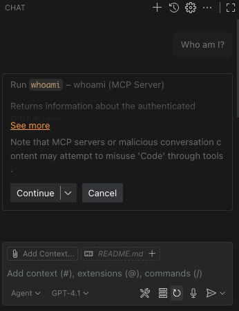
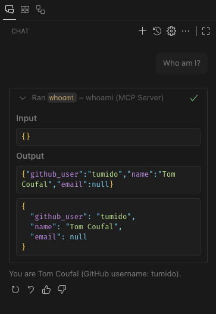

# GitHub Whoami MCP Server

This project implements a Minimal Control Protocol (MCP) server with GitHub authentication using the `fastmcp` library. The server provides a protected tool to retrieve information about the authenticated GitHub user.

## Features

- **GitHub Authentication**: Uses OAuth to authenticate users via GitHub.
- **Protected Tool**: `whoami` endpoint returns the authenticated user's GitHub username, name, and email.
- **Flexible Transport**: Supports `stdio`, `http`, and `sse` transport protocols.

## Prerequisites

- Python 3.8 or higher
- [UV](https://docs.astral.sh/uv/) for dependency management
- A GitHub OAuth App with a Client ID and Client Secret

## Installation

1. Clone the repository:
    ```bash
    git clone https://github.com/your-repo/mcp_auth.git
    cd mcp_auth
    ```

2. Install dependencies:
    ```bash
    uv sync
    source .venv/bin/activate
    ```
3. Create a Giuthub OAuth App:
    1. Go to [GitHub Developer Settings](https://github.com/settings/developers)
    2. Click on "New OAuth App"
    3. Choose any name
    4. Set "Homepage URL" to `http://{host}:{port}` (later use the same `host` and `port` as you will use to run the server, default is `http://localhost:8080`)
    5. Set "Authorization callback URL" to `http://{host}:{port}/auth/callback` (the default is `http://localhost:8080/auth/callback`)
    6. Click "Register application"
    7. Note down the `Client ID`
    8. Click "Generate a new client secret" and note down the `Client Secret`

## Usage

Run the MCP server with the following command:

```bash
python server.py --client_id <GITHUB_CLIENT_ID> --client_secret <GITHUB_CLIENT_SECRET>
```

### Options

- `--client_id`: GitHub OAuth App Client ID (or set `GITHUB_CLIENT_ID` environment variable)
- `--client_secret`: GitHub OAuth App Client Secret (or set `GITHUB_CLIENT_SECRET` environment variable)
- `--transport`: Transport protocol (`stdio`, `http`, or `sse`). Default: `http`
- `--port`: Server port for HTTP/SSE transport. Default: `8080`
- `--host`: Server host for HTTP/SSE transport. Default: `localhost`

## Example

To run the server with HTTP transport:

```bash
python server.py
```

Then connect to it

### Example VSCode Copilot

1. Configure the MCP server in VSCode Copilot.
    Via UI:

    1. Run command `MCP: Add Server...` in VSCode
    2. Select `http` as the transport
    3. Enter `http://localhost:8080/mcp` as the server URL
    4. Name it whatever you like (e.g., `whoami`)
    5. Select the `Workspace` scope
    6. Select to trust the server

    Via config file:

    Create file in `.vscode/mcp.json` with the following content:
    ```json
    {
        "servers": {
            "whoami": {
                "url": "http://localhost:8080/mcp",
                "type": "http"
            }
        },
        "inputs": []
    }
    ```

2. Use the tool
    1. pen a new VSCode Copilot chat session and select the `Agent` mode. Make sure the new MCP server is selected in the tool selection.

    2. Then ask the agent something like:

        ```
        Who am I?
        ```
    3. The agent will ask to use the `whoami` tool. Select `Continue`

        

    4. The agent should resolve the tool and return your GitHub user information.

        


## Protected Tool: `whoami`

The `whoami` tool returns information about the authenticated GitHub user. Example response:

```json
{
  "github_user": "octocat",
  "name": "The Octocat",
  "email": "octocat@github.com"
}
```


## Protected Tool: `get_open_prs`

The `get_open_prs` tool returns information about PRs that are open by the authenticated GitHub user. Example response:

```json
{
  "count": "1",
  "pull_requests": [
    {
        "title": "feat: create a simple MCP server to query GitHub for identity",
        "number": 21,
        "url": "https://github.com/redhat-et/cloud-native-agents/pull/21"
    }
  ]
}
```

## License

This project is licensed under the MIT License. See the LICENSE file for details.


## Known Issues

If user revokes the GitHub app authorization, the server will report that the user is not authenticated. However, attempts to re-authenticate will fail because VSCode insists on using the old invalid authorization Client ID. [The workaround](https://github.com/microsoft/vscode/issues/250960) is to run `Authentication: Remove Dynamic Authentication Providers` command in VSCode and then restart the MCP server client in VSCode and re-authenticate.
